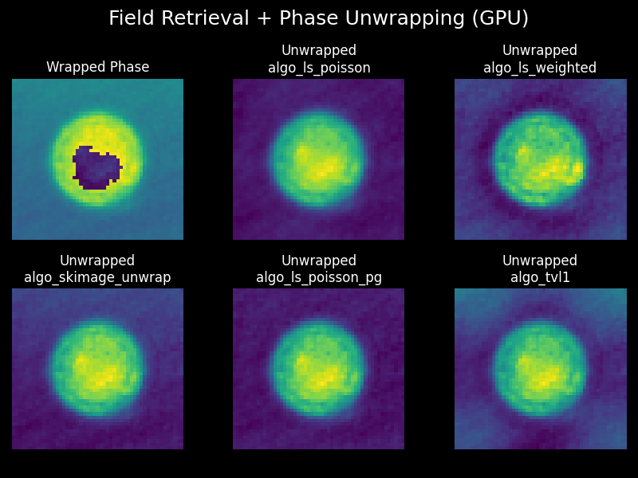

# Phase Unwrapping on GPU (and CPU), with Python

There are many phase unwrapping algorithms out there. Many are implemented in
CUDA, C++ etc. I haven't yet found any algorithm that interfaces 
**easily** with Python via the many wonderful GPU-based packages,
such as CuPy. Please inform me if you know of one that is open-source.

<!-- there is one via pytorch -->

This package aims to make GPU-based phase unwrapping in Python seamless.
If you don't have a GPU, don't worry, all the code works on the CPU
(albeit slower).

## Installation

```bash

    # if you have the CUDA Toolkit version 12x use:
    pip install unwrap_phase_gpu[cupy-cuda12x]

    # if you have the CUDA Toolkit version 13x use:
    pip install unwrap_phase_gpu[cupy-cuda13x]

    # to install and just use on the CPU, just don't use any optional dependencies:
    pip install unwrap_phase_gpu
```

## Compatible Phase Retrieval and Numerical Refocusing GPU packages

In the same group on GitHub, we have two other packages that work seamlessy
with `unwrap_phase_gpu`.
- Phase Retrieval that works on CPU and GPU: 
  [qpretrieve](https://github.com/RI-imaging/qpretrieve)
- Numerical Refocussing that works on CPU ([and soon GPU](https://github.com/RI-imaging/nrefocus/issues/23)): 
  [nrefocus](https://github.com/RI-imaging/nrefocus)
- If you are looking for a file format that can also work with the GPU, try 
  out [zarr-python](https://zarr.readthedocs.io/en/stable/user-guide/gpu/) 


## Documentation and Citations

There will soon be a Reference and API documentation website here
(unwrap_phase_gpu.readthedocs.io)

<!-- ## Citing this work -->


## Using `unwrap_phase_gpu`

There are several phase unwrapping algorithms to choose from:
- `algo_ls_poisson`: Least-squares Poisson solver
- `algo_ls_poisson_periodic_grad`: Least-squares unwrapping with periodic gradient enforcement
- `algo_ls_weighted`: Weighted least-squares unwrapping with border masking
- `algo_tvl1`: Total Variation L1 unwrapping
- Scikit-Image's Path Following algorithm (Herraez et al.) is not implemented
  here as it is not a GPU-suitable algorithm.

```python
"""
Field retrieval (qpretrieve) and
phase unwrapping (unwrap_phase_gpu) on GPU.
"""

from pathlib import Path

import matplotlib.pyplot as plt
import numpy as np
import qpretrieve
import unwrap_phase_gpu as upg

# Force GPU backend for both libraries.
upg.set_ndarray_backend("cupy")
qpretrieve.set_ndarray_backend("cupy")
xp = upg.get_ndarray_backend()

edata = np.load("./data/hologram_cell.npz")
holo = qpretrieve.OffAxisHologram(data=edata["data"])
bg = qpretrieve.OffAxisHologram(data=edata["bg_data"])

holo.run_pipeline(filter_name="disk", filter_size=1 / 2, scale_to_filter=True)
bg.process_like(holo)
phase_wrapped = xp.asarray(holo.phase - bg.phase).astype(xp.float32)

# Unwrap the phase with all available algorithms
outputs = {}
for algo_name, algo in upg.algos_available().items():
    outputs[algo_name] = algo(phase_wrapped)

# plot the wrapped and unwrapped phases
plt.style.use("dark_background")
fig, axes = plt.subplots(2, 3, figsize=(8, 6))
fig.suptitle("Field Retrieval + Phase Unwrapping (GPU)", fontsize=18)
axes = axes.flatten(order="F")

axes[0].imshow(phase_wrapped.get()[0])
axes[0].set_title("Wrapped Phase")

for i, (algo_name, arr) in enumerate(outputs.items(), start=2):
    ax = axes[i]
    ax.imshow(arr.get()[0])
    ax.set_title(f"Unwrapped\n{algo_name}")

for ax in axes:
    ax.set_axis_off()

plt.tight_layout(w_pad=4.5)
# plt.savefig("gpu_field_retr_phase_unwrapping.png")
plt.show()
```




## Developers

Install everything you need with (for example for cuda12x)
```bash
pip install -e .[cupy-cuda12x] --group dev
```


Run the unit tests with `pytest`
```bash
pip install -r tests/requirements.txt
pytest tests
```

Build docs with `sphinx`

```bash
pip install -r docs/requirements.txt
cd docs
sphinx-build . _build
```

Check the docs locally by opening `docs/_build/index.html` file in your browser.

### Package management with `uv`

If you wish to use `uv` to handle package management, then you need to first
install `uv` and then run:

For example, for the optional `cupy-cuda12x`

```bash
uv sync --group dev --extra cupy-cuda12x
```

Which should install all dev dependencies.
