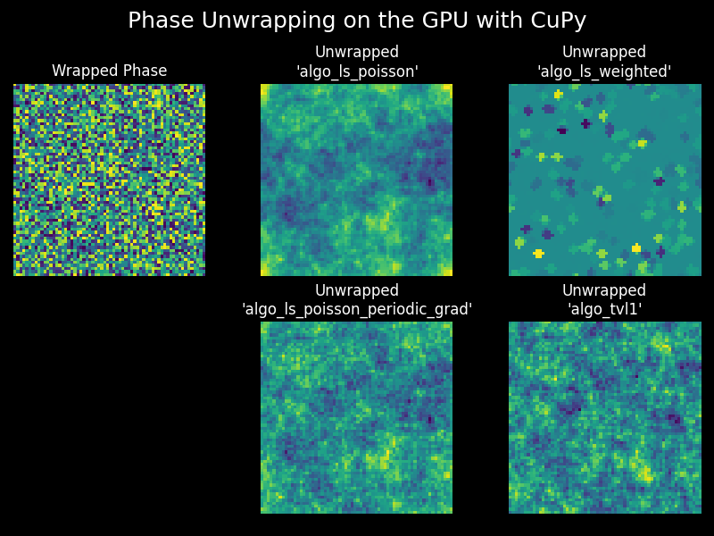

# Phase Unwrapping on GPU (and CPU), with Python

There are many phase unwrapping algorithms out there. Many are implemented in
CUDA, C++ etc. I haven't yet found any algorithm that interfaces 
**easily** with Python via the many wonderful GPU-based packages,
such as CuPy. Please inform me if you know of one that is open-source.

<!-- there is one via pytorch -->

This package aims to make GPU-based phase unwrapping in Python seamless.
If you don't have a GPU, don't worry, all the code works on the CPU
(albeit slower).

## Installation

    # if you have the CUDA Toolkit version 12x use:
    pip install unwrap_phase_gpu[cupy-cuda12x]

    # if you have the CUDA Toolkit version 13x use:
    pip install unwrap_phase_gpu[cupy-cuda13x]

    # to install and just use on the CPU, just don't use any optional 
    dependencies:
    pip install unwrap_phase_gpu


## Compatible Phase Retrieval and Numerical Refocusing GPU packages

In the same group on GitHub, we have two other packages that work seamlessy
with `unwrap_phase_gpu`.
- Phase Retrieval that works on CPU and GPU: 
  [qpretrieve](https://github.com/RI-imaging/qpretrieve)
- Numerical Refocussing that works on CPU and GPU: 
  [nrefocus](https://github.com/RI-imaging/nrefocus)
- If you are looking for a file format that can also work with the GPU, try 
  out [zarr-python](https://zarr.readthedocs.io/en/stable/user-guide/gpu/) 


## Documentation and Citations

There will soon be a Reference and API documentation website here
(unwrap_phase_gpu.readthedocs.io)

<!-- ## Citing this work -->


## Using `unwrap_phase_gpu`

There are several phase unwrapping algorithms to choose from:
- `algo_ls_poisson`: Least-squares Poisson solver
- `algo_ls_poisson_periodic_grad`: Least-squares unwrapping with periodic gradient enforcement
- `algo_ls_weighted`: Weighted least-squares unwrapping with border masking
- `algo_tvl1`: Total Variation L1 unwrapping
- Scikit-Image's Path Following algorithm (Herraez et al.) is not implemented
  here as it is not a GPU-suitable algorithm.

```python
import matplotlib.pyplot as plt
import unwrap_phase_gpu as upg

upg.set_ndarray_backend("cupy")
xp = upg.get_ndarray_backend()

# some fake wrapped phase data
rng = xp.random.default_rng(7)
phase_stack = rng.uniform(
    -xp.pi, xp.pi, size=(5, 64, 64)).astype(xp.float32)

algos_available = upg.algos_available()
outputs = {}
for algo_name, algo in algos_available.items():
    outputs[algo_name] = algo(phase_stack)

fig, axes = plt.subplots(2, 3, figsize=(8, 6))
fig.suptitle("Unwrap outputs on synthetic phase data")
axes = axes.flatten(order='F')

axes[0].imshow(phase_stack[0].get())
axes[0].set_title("Wrapped Phase")
axes[0].set_axis_off()
axes[1].set_axis_off()
for i, (algo_name, arr) in enumerate(outputs.items()):
    ax_num = i + 2
    arr_cpu = arr.get()[0]
    axes[ax_num].imshow(arr_cpu)
    axes[ax_num].set_title(f"Phase Unwrapped with\n'{algo_name}'")
    axes[ax_num].set_axis_off()

plt.tight_layout(w_pad=4.5)
plt.show()
```


